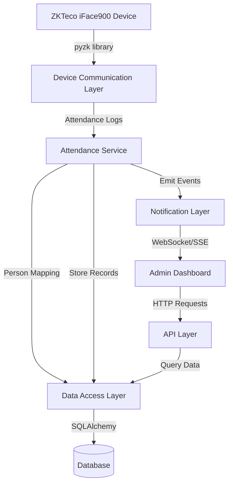
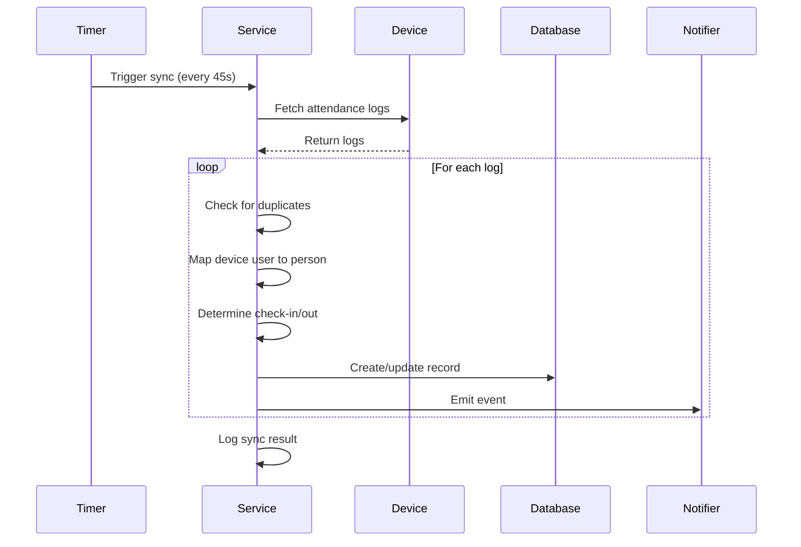

# Design Document: Biometric Attendance System

## Overview

The Biometric Attendance System integrates ZKTeco iFace900 biometric devices with the existing Flask-based Gym Management System to automate attendance tracking for members and trainers. The system continuously synchronizes attendance logs from the biometric device, maps device user IDs to gym members and trainers, implements check-in/check-out logic, and provides real-time notifications and analytics through an admin dashboard.

The design follows a service-oriented architecture with clear separation between device communication, business logic, data persistence, and presentation layers. The system runs as a background service that operates independently of web requests, ensuring continuous attendance monitoring even when no administrators are logged in.

### Key Design Goals

- Reliable device communication with automatic reconnection
- Real-time attendance event processing and notification
- Accurate check-in/check-out pairing logic
- Comprehensive attendance analytics and reporting
- Minimal latency between physical scan and dashboard update
- Robust error handling and logging

## Architecture

### System Components

The system consists of five primary components:

1. **Device Communication Layer**: Handles connection to ZKTeco iFace900 using the pyzk library
2. **Attendance Service**: Background service that orchestrates sync operations and business logic
3. **Data Access Layer**: SQLAlchemy models and database operations
4. **API Layer**: Flask REST endpoints for frontend consumption
5. **Real-Time Notification Layer**: WebSocket/SSE for push notifications to admin dashboard

### Component Interaction Flow



### Background Service Architecture

The Attendance Service runs as a separate thread or process within the Flask application context:

- Uses APScheduler or threading.Timer for periodic sync operations
- Maintains persistent database connection through SQLAlchemy session
- Emits events to Flask-SocketIO or SSE endpoint for real-time updates
- Implements exponential backoff for device connection retries

### Technology Stack

- **Backend Framework**: Flask 3.0.0
- **Database ORM**: SQLAlchemy 2.0.23+
- **Device Communication**: pyzk library (to be added)
- **Real-Time Communication**: Flask-SocketIO (to be added) or Server-Sent Events
- **Background Tasks**: APScheduler (to be added) or threading
- **Database**: SQLite (development) / PostgreSQL (production)
- **Testing**: pytest, hypothesis for property-based testing

## Components and Interfaces

### 1. Device Communication Module

**Module**: `backend/services/biometric_service.py`

**Responsibilities**:
- Establish and maintain connection to ZKTeco device
- Fetch attendance logs from device
- Handle connection errors and retries
- Extract attendance data from device response

**Key Classes**:

```python
class BiometricDeviceClient:
    def __init__(self, ip: str, port: int):
        """Initialize device client with connection parameters."""
        
    def connect(self) -> bool:
        """Establish connection to device. Returns success status."""
        
    def disconnect(self) -> None:
        """Close device connection and cleanup resources."""
        
    def get_attendance_logs(self) -> List[AttendanceLog]:
        """Fetch all attendance logs from device."""
        
    def is_connected(self) -> bool:
        """Check if device connection is active."""
```

**Configuration**:
- Device IP: 192.168.0.201
- Device Port: 4370
- Connection Timeout: 10 seconds
- Retry Interval: 60 seconds

### 2. Attendance Service Module

**Module**: `backend/services/attendance_service.py`

**Responsibilities**:
- Orchestrate periodic sync operations
- Map device user IDs to members/trainers
- Implement check-in/check-out logic
- Prevent duplicate entries
- Emit real-time notifications
- Handle errors and logging

**Key Classes**:

```python
class AttendanceService:
    def __init__(self, device_client: BiometricDeviceClient, 
                 db_session, notification_emitter):
        """Initialize service with dependencies."""
        
    def start_sync_loop(self, interval_seconds: int = 45):
        """Start background sync loop."""
        
    def sync_attendance_logs(self) -> SyncResult:
        """Fetch and process new attendance logs."""
        
    def process_attendance_log(self, log: AttendanceLog) -> Optional[AttendanceRecord]:
        """Process single log entry and create/update record."""
        
    def map_device_user_to_person(self, device_user_id: str) -> Optional[PersonMapping]:
        """Map device user ID to member or trainer."""
        
    def determine_check_type(self, person_id: str, person_type: str, 
                            timestamp: datetime) -> CheckType:
        """Determine if scan is check-in or check-out."""
        
    def calculate_stay_duration(self, check_in: datetime, 
                               check_out: datetime) -> int:
        """Calculate stay duration in minutes."""
```

**Sync Operation Flow**:



### 3. Person Mapping Configuration

**Module**: `backend/models/device_user_mapping.py`

**Responsibilities**:
- Store mapping between device user IDs and gym persons
- Support CRUD operations for mappings
- Provide lookup functionality

**Database Table**: `device_user_mappings`

```python
class DeviceUserMapping(db.Model):
    id: str  # UUID
    device_user_id: str  # From biometric device
    person_type: str  # 'member' or 'trainer'
    person_id: str  # Foreign key to member_profiles or trainer_profiles
    created_at: datetime
    updated_at: datetime
```

**API Endpoints for Mapping Management**:
- `POST /api/attendance/mappings` - Create new mapping
- `GET /api/attendance/mappings` - List all mappings
- `PUT /api/attendance/mappings/{id}` - Update mapping
- `DELETE /api/attendance/mappings/{id}` - Delete mapping

### 4. Attendance Record Model

**Module**: `backend/models/attendance_record.py`

**Database Table**: `attendance_records`

```python
class AttendanceRecord(db.Model):
    id: str  # UUID primary key
    device_user_id: str  # Original device user ID
    person_type: str  # 'member' or 'trainer'
    person_id: str  # Foreign key to member or trainer
    check_in_time: datetime  # UTC timestamp
    check_out_time: Optional[datetime]  # UTC timestamp, nullable
    stay_duration: Optional[int]  # Minutes, nullable until check-out
    device_serial: str  # Device identifier
    created_at: datetime
    updated_at: datetime
    
    # Indexes
    __table_args__ = (
        Index('idx_device_user_id', 'device_user_id'),
        Index('idx_person_id', 'person_id'),
        Index('idx_check_in_time', 'check_in_time'),
        Index('idx_person_type', 'person_type'),
    )
```

**Relationships**:
- `person_id` references either `member_profiles.id` or `trainer_profiles.id` based on `person_type`
- Polymorphic relationship handled at application level

### 5. API Endpoints

**Module**: `backend/routes/attendance.py`

All endpoints require authentication (JWT token).

**Sync and Manual Operations**:
- `POST /api/attendance/sync` - Trigger manual sync operation
  - Response: `{success: bool, records_processed: int, message: str}`

**Data Retrieval**:
- `GET /api/attendance/today` - Get today's attendance records
  - Query params: `person_type` (optional filter)
  - Response: `{records: List[AttendanceRecord]}`

- `GET /api/attendance/history` - Get attendance history with filters
  - Query params: `start_date`, `end_date`, `person_type`, `person_id`, `page`, `per_page`
  - Response: `{records: List[AttendanceRecord], total: int, page: int, pages: int}`

- `GET /api/attendance/live` - Get currently checked-in persons
  - Response: `{members: List[LiveAttendance], trainers: List[LiveAttendance]}`

**Analytics**:
- `GET /api/attendance/analytics/weekly` - Weekly attendance summary
  - Query params: `week_offset` (0 = current week, -1 = last week)
  - Response: `{days: List[{date: str, count: int}]}`

- `GET /api/attendance/analytics/monthly` - Monthly attendance summary
  - Query params: `month_offset` (0 = current month)
  - Response: `{days: List[{date: str, count: int}]}`

- `GET /api/attendance/analytics/top-members` - Top visiting members
  - Query params: `month_offset`, `limit` (default 10)
  - Response: `{members: List[{name: str, visit_count: int}]}`

- `GET /api/attendance/analytics/average-stay` - Average stay duration
  - Query params: `period` ('day', 'week', 'month')
  - Response: `{average_minutes: int, formatted: str}`

**Dashboard Summary**:
- `GET /api/attendance/dashboard/summary` - Dashboard summary metrics
  - Response: `{today_checkins: int, members_inside: int, trainers_inside: int, avg_stay_today: int}`

### 6. Real-Time Notification System

**Implementation Options**:

**Option A: Flask-SocketIO (WebSocket)**
- Bidirectional communication
- Better for complex interactions
- Requires Socket.IO client library

**Option B: Server-Sent Events (SSE)**
- Unidirectional server-to-client
- Simpler implementation
- Native browser support

**Recommended**: Flask-SocketIO for richer functionality

**Module**: `backend/services/notification_service.py`

```python
class NotificationService:
    def __init__(self, socketio):
        """Initialize with Flask-SocketIO instance."""
        
    def emit_check_in(self, person_name: str, person_type: str, 
                     check_in_time: datetime):
        """Emit check-in notification to admin clients."""
        
    def emit_check_out(self, person_name: str, person_type: str,
                      check_in_time: datetime, stay_duration: int):
        """Emit check-out notification to admin clients."""
```

**WebSocket Events**:
- `attendance:checkin` - Emitted when person checks in
- `attendance:checkout` - Emitted when person checks out
- `attendance:summary_update` - Emitted when dashboard summary changes

**Event Payload Structure**:
```json
{
  "event_type": "checkin",
  "person_name": "John Doe",
  "person_type": "member",
  "timestamp": "2024-01-15T10:30:00Z",
  "stay_duration": null
}
```

### 7. Admin Dashboard Frontend

**Component Structure**:

```
frontend/src/pages/admin/AdminAttendance.jsx
├── SummaryCards (today stats)
├── LiveActivityFeed (recent 20 events)
├── CurrentlyInsideWidget (members/trainers inside)
├── AttendanceHistoryTable (searchable, filterable)
├── WeeklyChart (bar/line chart)
├── MonthlyChart (line/area chart)
├── TopMembersWidget (top 10 visitors)
└── AverageStayWidget (day/week/month averages)
```

**State Management**:
- Use React hooks (useState, useEffect) for local state
- WebSocket connection for real-time updates
- Periodic polling as fallback (every 30 seconds)

**Real-Time Update Strategy**:
1. Establish WebSocket connection on component mount
2. Listen for attendance events
3. Update local state when events received
4. Refresh summary metrics
5. Add to activity feed
6. Update charts if date range affected

## Data Models

### AttendanceRecord

```python
class AttendanceRecord(db.Model):
    __tablename__ = 'attendance_records'
    
    id = db.Column(db.String(36), primary_key=True, default=lambda: str(uuid.uuid4()))
    device_user_id = db.Column(db.String(50), nullable=False, index=True)
    person_type = db.Column(db.String(10), nullable=False, index=True)  # 'member' or 'trainer'
    person_id = db.Column(db.String(36), nullable=False, index=True)
    check_in_time = db.Column(db.DateTime, nullable=False, index=True)
    check_out_time = db.Column(db.DateTime, nullable=True)
    stay_duration = db.Column(db.Integer, nullable=True)  # Minutes
    device_serial = db.Column(db.String(50), nullable=False)
    created_at = db.Column(db.DateTime, default=datetime.utcnow, nullable=False)
    updated_at = db.Column(db.DateTime, default=datetime.utcnow, 
                          onupdate=datetime.utcnow, nullable=False)
    
    def to_dict(self):
        return {
            'id': self.id,
            'device_user_id': self.device_user_id,
            'person_type': self.person_type,
            'person_id': self.person_id,
            'check_in_time': self.check_in_time.isoformat() + 'Z',
            'check_out_time': self.check_out_time.isoformat() + 'Z' if self.check_out_time else None,
            'stay_duration': self.stay_duration,
            'device_serial': self.device_serial,
            'created_at': self.created_at.isoformat() + 'Z',
            'updated_at': self.updated_at.isoformat() + 'Z'
        }
```

### DeviceUserMapping

```python
class DeviceUserMapping(db.Model):
    __tablename__ = 'device_user_mappings'
    
    id = db.Column(db.String(36), primary_key=True, default=lambda: str(uuid.uuid4()))
    device_user_id = db.Column(db.String(50), nullable=False, unique=True, index=True)
    person_type = db.Column(db.String(10), nullable=False)  # 'member' or 'trainer'
    person_id = db.Column(db.String(36), nullable=False)
    created_at = db.Column(db.DateTime, default=datetime.utcnow, nullable=False)
    updated_at = db.Column(db.DateTime, default=datetime.utcnow, 
                          onupdate=datetime.utcnow, nullable=False)
    
    __table_args__ = (
        db.UniqueConstraint('person_type', 'person_id', name='uq_person'),
    )
    
    def to_dict(self):
        return {
            'id': self.id,
            'device_user_id': self.device_user_id,
            'person_type': self.person_type,
            'person_id': self.person_id,
            'created_at': self.created_at.isoformat() + 'Z',
            'updated_at': self.updated_at.isoformat() + 'Z'
        }
```

### Database Migration

A new Alembic migration will be created to add these tables:

```bash
alembic revision -m "add_biometric_attendance_tables"
```

The migration will:
1. Create `attendance_records` table with indexes
2. Create `device_user_mappings` table with unique constraints
3. Add foreign key constraints (soft references, not enforced at DB level due to polymorphic relationship)


## Correctness Properties

A property is a characteristic or behavior that should hold true across all valid executions of a system—essentially, a formal statement about what the system should do. Properties serve as the bridge between human-readable specifications and machine-verifiable correctness guarantees.

### Property Reflection

After analyzing all acceptance criteria, I identified several areas of redundancy:

- Properties 3.2 and 3.3 (storing person_type and person_id) can be combined into a single property about complete person mapping storage
- Properties 7.3 and 7.4 (notification content) are already covered by 18.2, which is redundant
- Property 10.7 and 15.5 (stay duration formatting) are identical and can be consolidated
- Properties 2.4 and 20.2 (logging successful sync operations) are duplicates
- Properties 3.4 and 20.4 (logging unmapped device user IDs) are duplicates
- Properties 8.2 and 8.3 (counting members/trainers inside) can be combined into a single property about counting by person type
- Properties 12.1 and 12.2 (weekly analytics) can be combined into a single comprehensive property
- Properties 13.1 and 13.2 (monthly analytics) can be combined into a single comprehensive property
- Properties 14.2, 14.3, 14.4, and 14.5 can be combined into a single comprehensive property about top members calculation

The following properties represent the unique, non-redundant correctness guarantees for the system.

### Property 1: Connection Error Logging

For any connection failure to the biometric device, the system should create a log entry containing a timestamp and device details.

**Validates: Requirements 1.3**

### Property 2: Connectivity Verification Before Fetch

For any attempt to fetch attendance logs, the system should only proceed if device connectivity has been successfully verified.

**Validates: Requirements 1.4**

### Property 3: Sequential Log Processing

For any batch of attendance logs retrieved from the device, the system should process each log entry in the order it was received.

**Validates: Requirements 2.2**

### Property 4: Complete Data Extraction

For any attendance log entry from the device, the system should successfully extract device_user_id, timestamp, and device_serial fields.

**Validates: Requirements 2.3**

### Property 5: Successful Sync Logging

For any successfully completed sync operation, the system should create a log entry containing the number of records processed.

**Validates: Requirements 2.4, 20.2**

### Property 6: Error Logging and Recovery

For any sync operation that fails, the system should log the error and continue with the next scheduled sync without stopping the service.

**Validates: Requirements 2.5**

### Property 7: Device User to Person Mapping

For any device_user_id that has a valid mapping configuration, the system should successfully map it to either a member or trainer.

**Validates: Requirements 3.1**

### Property 8: Complete Person Data Storage

For any created attendance record, the system should store both person_type (member or trainer) and person_id fields.

**Validates: Requirements 3.2, 3.3**

### Property 9: Unmapped ID Warning

For any device_user_id that cannot be mapped to a person, the system should create a warning log entry containing the unmapped device_user_id.

**Validates: Requirements 3.4, 20.4**

### Property 10: First Scan Creates Check-In

For any person's first scan on a given day, the system should create a new attendance record with check_in_time populated.

**Validates: Requirements 4.1**

### Property 11: Second Scan Updates Check-Out

For any person's second scan on the same day, the system should update the existing attendance record with check_out_time rather than creating a new record.

**Validates: Requirements 4.2**

### Property 12: Stay Duration Calculation

For any attendance record with both check_in_time and check_out_time, the stay_duration field should equal the time difference between them in minutes.

**Validates: Requirements 4.3, 4.4**

### Property 13: Third Scan Creates New Visit

For any person's third scan on the same day (after a complete check-in/check-out cycle), the system should create a new attendance record for a separate visit.

**Validates: Requirements 4.5**

### Property 14: Duplicate Detection

For any attendance log entry being processed, the system should check for existing records with matching device_user_id, timestamp, and device_serial before creating a new record.

**Validates: Requirements 5.1, 5.2**

### Property 15: Duplicate Entry Prevention

For any attendance log entry that matches an existing record (same device_user_id, timestamp, and device_serial), the system should skip insertion and create a duplicate warning log entry.

**Validates: Requirements 5.3**

### Property 16: Multi-Day Check-Ins Allowed

For any person, the system should allow attendance records to be created on different days without restriction.

**Validates: Requirements 5.4**

### Property 17: Multiple Daily Visits Allowed

For any person on a given day, the system should allow multiple complete visit records (check-in followed by check-out) to be created.

**Validates: Requirements 5.5**

### Property 18: Complete Record Schema

For any created attendance record, the system should populate all required fields: id, device_user_id, person_type, person_id, check_in_time, device_serial, and created_at.

**Validates: Requirements 6.1**

### Property 19: UUID Identifier Format

For any created attendance record, the id field should be a valid UUID string.

**Validates: Requirements 6.2**

### Property 20: Person Type Validation

For any created attendance record, the person_type field should contain either "member" or "trainer" and no other values.

**Validates: Requirements 6.3**

### Property 21: Nullable Check-Out Time

For any attendance record representing an incomplete visit (person still inside), the check_out_time field should be null.

**Validates: Requirements 6.4**

### Property 22: UTC Timestamp Storage

For any created attendance record, all timestamp fields (check_in_time, check_out_time, created_at, updated_at) should be stored in UTC format.

**Validates: Requirements 6.5**

### Property 23: Check-In Notification Delivery

For any person who completes a check-in, the system should send a notification to all connected administrators.

**Validates: Requirements 7.1**

### Property 24: Check-Out Notification Delivery

For any person who completes a check-out, the system should send a notification to all connected administrators.

**Validates: Requirements 7.2**

### Property 25: Check-In Notification Content

For any check-in notification, the message should contain the person's name, person_type, and check_in_time.

**Validates: Requirements 7.3, 18.2**

### Property 26: Check-Out Notification Content

For any check-out notification, the message should contain the person's name, person_type, check_in_time, and stay_duration.

**Validates: Requirements 7.4, 18.2**

### Property 27: Daily Check-In Count

For any given day, the dashboard summary should display the correct total count of check-in events that occurred on that day.

**Validates: Requirements 8.1**

### Property 28: Currently Inside Count by Type

For any given moment, the dashboard should display the correct count of persons currently inside the gym, grouped by person_type (members and trainers separately).

**Validates: Requirements 8.2, 8.3**

### Property 29: Daily Average Stay Duration

For any given day, the dashboard should display the correct average stay_duration calculated from all completed visits on that day.

**Validates: Requirements 8.4**

### Property 30: Currently Inside Calculation Logic

For any attendance record, it should be counted as "currently inside" if and only if check_in_time is populated and check_out_time is null.

**Validates: Requirements 8.6**

### Property 31: Activity Feed Entry Content

For any entry in the activity feed, the system should include person_name, person_type, check_in_time, and status (Inside or Checked Out).

**Validates: Requirements 9.2**

### Property 32: Attendance Table Column Completeness

For any attendance table response, the data should include all required columns: Name, Role (person_type), Check_In, Check_Out, Total Time Stayed (stay_duration), and Device (device_serial).

**Validates: Requirements 10.1**

### Property 33: Name Search Filtering

For any name search query, the attendance table results should only include records where the person's name matches the search term.

**Validates: Requirements 10.2**

### Property 34: Person Type Filtering

For any person_type filter applied to the attendance table, the results should only include records matching that person_type.

**Validates: Requirements 10.3**

### Property 35: Date Range Filtering

For any date range filter applied to the attendance table, the results should only include records where check_in_time falls within the specified range.

**Validates: Requirements 10.4**

### Property 36: Pagination Correctness

For any page number and page size specified, the attendance table should return the correct subset of results (page_size * (page - 1) through page_size * page).

**Validates: Requirements 10.5**

### Property 37: Default Sort Order

For any attendance table query without explicit sort parameters, the results should be ordered by check_in_time in descending order (most recent first).

**Validates: Requirements 10.6**

### Property 38: Stay Duration Formatting

For any stay_duration value in minutes, the system should format it as "Xh Ym" where X is hours and Y is remaining minutes.

**Validates: Requirements 10.7, 15.5**

### Property 39: Currently Inside Entry Content

For any person currently inside the gym, the widget entry should contain person_name, check_in_time, and calculated time_spent_so_far.

**Validates: Requirements 11.2**

### Property 40: Currently Inside Grouping

For any "currently inside" response, the data should be grouped by person_type with separate lists for members and trainers.

**Validates: Requirements 11.5**

### Property 41: Weekly Analytics Accuracy

For any week, the analytics should correctly count and group check-ins by day of week (Monday through Sunday) for all seven days.

**Validates: Requirements 12.1, 12.2**

### Property 42: Monthly Analytics Accuracy

For any month, the analytics should correctly count and group check-ins by date for all days in that month.

**Validates: Requirements 13.1, 13.2**

### Property 43: Top Members Calculation

For any month, the top members list should include only members (not trainers), show member name and visit count, be sorted by visit count in descending order, and count each check-in as one visit.

**Validates: Requirements 14.1, 14.2, 14.3, 14.4, 14.5**

### Property 44: Period-Based Average Stay

For any time period (day, week, or month), the average stay duration should be calculated only from completed visits (records with check_out_time) within that period.

**Validates: Requirements 15.1, 15.2, 15.3, 15.4**

### Property 45: JSON Response Format

For any API endpoint response, the system should return valid JSON with an appropriate HTTP status code (2xx for success, 4xx for client errors, 5xx for server errors).

**Validates: Requirements 16.6**

### Property 46: Authentication Requirement

For any request to an attendance API endpoint without valid authentication credentials, the system should reject the request with a 401 Unauthorized status.

**Validates: Requirements 16.7**

### Property 47: Comprehensive Error Logging

For any error that occurs in the attendance service, the system should create a log entry containing timestamp, error_type, and stack_trace.

**Validates: Requirements 20.1**

### Property 48: Connection Status Change Logging

For any change in device connection status (connected to disconnected or vice versa), the system should create a log entry documenting the status change.

**Validates: Requirements 20.3**

### Property 49: Graceful Shutdown Cleanup

For any application shutdown event, the attendance service should close the device connection and release all acquired resources before terminating.

**Validates: Requirements 19.5**

## Error Handling

### Device Communication Errors

**Connection Failures**:
- Log error with timestamp, IP, port, and error message
- Implement exponential backoff: 60s, 120s, 240s, max 300s
- Continue retry attempts indefinitely
- Emit connection status events to monitoring

**Timeout Errors**:
- Set connection timeout to 10 seconds
- Set read timeout to 15 seconds
- Log timeout events with context
- Retry with same interval as connection failures

**Device Unavailable**:
- Detect when device is powered off or network unreachable
- Log device unavailability
- Continue background sync loop
- Resume normal operation when device becomes available

### Data Processing Errors

**Unmapped Device User IDs**:
- Log warning with device_user_id and timestamp
- Skip record creation for unmapped IDs
- Continue processing remaining logs
- Provide admin interface to create mappings

**Invalid Data Format**:
- Log error with raw log entry data
- Skip malformed entries
- Continue processing remaining logs
- Alert administrators if error rate exceeds threshold

**Database Errors**:
- Wrap all database operations in try-catch blocks
- Log database errors with full context
- Rollback transactions on error
- Retry failed operations with exponential backoff

### API Errors

**Authentication Failures**:
- Return 401 Unauthorized with clear error message
- Log authentication attempts
- Rate limit failed authentication attempts

**Invalid Request Parameters**:
- Return 400 Bad Request with validation errors
- Include field-level error messages
- Log invalid requests for monitoring

**Server Errors**:
- Return 500 Internal Server Error
- Log full stack trace
- Hide internal details from client
- Alert administrators for critical errors

### Notification Errors

**WebSocket Connection Failures**:
- Implement automatic reconnection with exponential backoff
- Queue notifications during disconnection
- Deliver queued notifications on reconnection
- Limit queue size to prevent memory issues

**Notification Delivery Failures**:
- Log failed notification attempts
- Continue service operation
- Don't block attendance processing on notification failures

## Testing Strategy

### Unit Testing

Unit tests will focus on specific examples, edge cases, and integration points:

**Device Communication**:
- Test successful connection to device
- Test connection failure handling
- Test timeout handling
- Test data extraction from device logs

**Attendance Logic**:
- Test first scan creates check-in
- Test second scan creates check-out
- Test third scan creates new visit
- Test stay duration calculation
- Test same-day multiple visits
- Test cross-day visits

**Duplicate Prevention**:
- Test exact duplicate detection
- Test duplicate skipping
- Test duplicate logging

**Person Mapping**:
- Test valid mapping lookup
- Test unmapped ID handling
- Test member mapping
- Test trainer mapping

**API Endpoints**:
- Test each endpoint with valid data
- Test authentication requirement
- Test invalid parameters
- Test error responses

**Edge Cases**:
- Empty attendance log response
- Null/missing fields in device data
- Invalid timestamps
- Concurrent check-ins
- Check-out without check-in

### Property-Based Testing

Property-based tests will verify universal properties across randomized inputs. Each test will run a minimum of 100 iterations.

**Testing Library**: Hypothesis (Python)

**Property Test Configuration**:
```python
from hypothesis import given, settings
import hypothesis.strategies as st

@settings(max_examples=100)
@given(...)
def test_property_name(...):
    # Feature: biometric-attendance-system, Property X: [property text]
    pass
```

**Key Properties to Test**:

1. **Stay Duration Calculation** (Property 12)
   - Generate random check-in and check-out times
   - Verify stay_duration equals time difference in minutes
   - Tag: Feature: biometric-attendance-system, Property 12: Stay Duration Calculation

2. **Duplicate Detection** (Property 14, 15)
   - Generate random attendance logs
   - Process same log twice
   - Verify only one record created
   - Tag: Feature: biometric-attendance-system, Property 15: Duplicate Entry Prevention

3. **Person Type Validation** (Property 20)
   - Generate random attendance records
   - Verify person_type is always "member" or "trainer"
   - Tag: Feature: biometric-attendance-system, Property 20: Person Type Validation

4. **UUID Format** (Property 19)
   - Generate random attendance records
   - Verify id field is valid UUID
   - Tag: Feature: biometric-attendance-system, Property 19: UUID Identifier Format

5. **Date Range Filtering** (Property 35)
   - Generate random date ranges and attendance records
   - Apply filter
   - Verify all results fall within range
   - Tag: Feature: biometric-attendance-system, Property 35: Date Range Filtering

6. **Pagination Correctness** (Property 36)
   - Generate random page sizes and page numbers
   - Verify correct subset returned
   - Verify no duplicates across pages
   - Tag: Feature: biometric-attendance-system, Property 36: Pagination Correctness

7. **Stay Duration Formatting** (Property 38)
   - Generate random minute values
   - Verify format is "Xh Ym"
   - Verify round-trip: parse(format(minutes)) == minutes
   - Tag: Feature: biometric-attendance-system, Property 38: Stay Duration Formatting

8. **Currently Inside Calculation** (Property 30)
   - Generate random attendance records with various check-in/check-out states
   - Verify "inside" count matches records with null check_out_time
   - Tag: Feature: biometric-attendance-system, Property 30: Currently Inside Calculation Logic

9. **Multiple Daily Visits** (Property 17)
   - Generate random number of complete visits for same person on same day
   - Verify all visits are stored separately
   - Tag: Feature: biometric-attendance-system, Property 17: Multiple Daily Visits Allowed

10. **Authentication Requirement** (Property 46)
    - Generate random API requests without auth tokens
    - Verify all return 401 Unauthorized
    - Tag: Feature: biometric-attendance-system, Property 46: Authentication Requirement

**Generator Strategies**:

```python
# Generate valid person types
person_type_strategy = st.sampled_from(['member', 'trainer'])

# Generate valid timestamps
timestamp_strategy = st.datetimes(
    min_value=datetime(2024, 1, 1),
    max_value=datetime(2025, 12, 31),
    timezones=st.just(timezone.utc)
)

# Generate attendance records
attendance_record_strategy = st.builds(
    AttendanceRecord,
    device_user_id=st.text(min_size=1, max_size=50),
    person_type=person_type_strategy,
    person_id=st.uuids().map(str),
    check_in_time=timestamp_strategy,
    check_out_time=st.one_of(st.none(), timestamp_strategy),
    device_serial=st.text(min_size=1, max_size=50)
)

# Generate stay durations (0 to 24 hours in minutes)
stay_duration_strategy = st.integers(min_value=0, max_value=1440)
```

### Integration Testing

Integration tests will verify component interactions:

**Device to Database Flow**:
- Mock device with test data
- Run sync operation
- Verify records in database
- Verify notifications emitted

**API to Database Flow**:
- Create test data in database
- Call API endpoints
- Verify correct data returned
- Verify filters and pagination work

**End-to-End Attendance Flow**:
- Simulate device scan
- Verify record created
- Verify notification sent
- Verify dashboard updated
- Simulate second scan
- Verify record updated with check-out

### Test Coverage Goals

- Unit test coverage: 85%+
- Property test coverage: All 49 properties
- Integration test coverage: All critical paths
- API endpoint coverage: 100%

